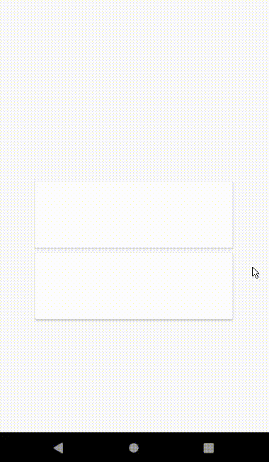

# Some Material Motion Implementations

## Navigation Transitions - Parent-To-Child Transition

>From a parent screen, an embedded child element lifts up on touch and expands in place

- [Material Guidelines](https://material.io/design/navigation/navigation-transitions.html#hierarchical-transitions)

